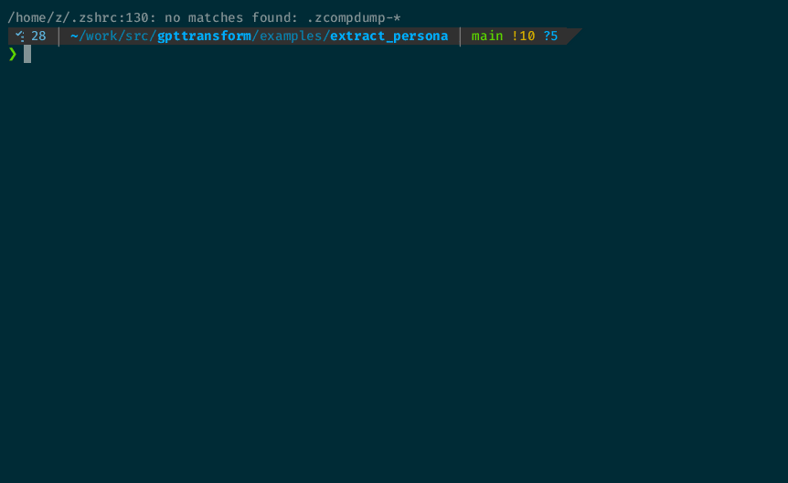

# ThoughtLoom: Transform Data into Insights with OpenAI LLMs

ThoughtLoom is a powerful tool designed to foster creativity and enhance productivity through the use of LLMs directly from the command line. It facilitates rapid development and integration of LLM-based tools into various workflows, empowering individuals and teams to experiment, collaborate, and ultimately streamline their daily tasks.

By using ThoughtLoom's template system, teams can coordinate and fine-tune the most effective ways to leverage LLMs for their specific needs. This structured approach allows for seamless incorporation of LLMs into pipelines that can tackle increasingly complex objectives. ThoughtLoom's versatility enables users to create simple shell scripts or more sophisticated programs, depending on the requirements of the task at hand.

Ultimately, ThoughtLoom accelerates the adoption, experimentation, and practical use of LLMs by providing a flexible, user-friendly environment to build and share LLM-based tools. It's an invaluable resource for anyone looking to harness the power of language models in their daily work, whether for personal, team, or enterprise applications.



## Features

- Puts the power of OpenAI chat-gpt APIs in your terminal
- Template and configuration system so you can define and invoke arbitrary processing tasks
- Parallel / batch processing of large data sets
- Estimate API costs before running commands
- JSON in, JSON out

## Installation

```bash
go install github.com/tbiehn/thoughtloom@latest
```

## Some GPT Thoughts on ThoughtLoom

ThoughtLoom is a powerful command-line tool that brings the potential of OpenAI APIs to the fingertips of power-users and professionals, enabling a more efficient and robust way to generate insights and narratives. While it may not revolutionize entire industries on its own, it does provide an enhanced user experience for those looking to leverage OpenAI APIs for practical, real-world applications.

1. **Streamlining Content Creation**: ThoughtLoom allows writers, marketers, and other content creators to quickly generate drafts, summaries, and article ideas, boosting productivity and reducing the time spent on mundane tasks.

2. **Data Analysis Made Simple**: Researchers, data analysts, and business professionals can use ThoughtLoom to extract valuable insights from complex datasets, making the process of data analysis more efficient and accessible.

3. **Enhancing Customer Support**: ThoughtLoom can be utilized to analyze customer feedback and support queries, generating valuable insights that can help improve customer service and drive customer satisfaction.

4. **Automating Reporting**: Business users can leverage ThoughtLoom to generate automated reports on key performance indicators, trends, and competitor analysis, saving time and resources.

5. **Simplifying Documentation**: Developers, product managers, and technical writers can use ThoughtLoom to generate technical documentation, code comments, and API descriptions with ease, improving the overall development process.

ThoughtLoom is a versatile tool designed to empower power-users and professionals in their day-to-day tasks, making it easier to harness the capabilities of OpenAI APIs. While it may not change the world, it can certainly make a significant difference for those who use it, by simplifying complex tasks, improving productivity, and providing a more user-friendly experience.

## Usage

ThoughtLoom is a powerful command-line tool designed to process JSON data using predefined templates and connect to OpenAI (or Azure) APIs to generate valuable insights. The following steps outline the general usage of ThoughtLoom:

1. Supply input JSON data through stdin.
2. Set your OpenAI API key using the 'OPENAI_API_KEY' environment variable or Azure AI API key using the 'AZUREAI_API_KEY' environment variable.

_WARNING: API requests may incur costs. Use the flag '-d' to estimate your potential cost before running the actual process._

### Command-line Flags

- `-ae string`: Set the Azure HTTP Endpoint if using Azure. Set the environment variable 'AZUREAI_API_KEY' to your API key.
- `-am string`: Set the model deployment name if using Azure.
- `-b`: Disable the progress bar. Set `-b` all by itself to enable it.
- `-c string`: Set the path to the configuration file (default `./config.toml`).
- `-d`: Perform a dry run, calculating token usage without making a request. Set `-d` all by itself to enable it.
- `-l string`: Set the log level (options: debug, info, warn, error, fatal, panic) (default "info").
- `-p int`: Set how many parallel calls to make to OpenAI (default 5).

### Configs and Templates

Configuration files are `toml` that specify templates to use when turning JSON inputs into OpenAI queries.

```toml
# Required parameters
max_tokens = 2048                      # The maximum number of tokens for the generated response.
model = "gpt-3.5-turbo"                # The model to use for text generation, e.g., gpt-3.5-turbo, gpt-4, etc.

# Optional parameters (if not provided, the program will use default values)
temperature = 0.7                      # Controls the randomness of the generated text.
top_p = 0.9                            # Controls the nucleus sampling, which limits the token selection to a subset.
presence_penalty = 0.1                 # Penalty for using the same token multiple times.
frequency_penalty = 0.1                # Penalty for using tokens that are less common.

template_system = "./system.tmpl"      # The path to the system prompt template file.
template_user = "./user.tmpl"          # The path to the user prompt template file.

```

Optionally, few-shot examples can be specified by using a slightly different format;

```toml
max_tokens = 2048
model = "gpt-3.5-turbo"
template_system = "./system.tmpl"
temperature = 0.8

[[template_prompt]] 
	role = "user"
	template = "./1shotuser.tmpl"

[[template_prompt]] 
	role = "assistant"
	template = "./1shotassistant.tmpl"

[[template_prompt]] 
	role = "user"
	template = "./user.tmpl"
	
```

Here `1shotuser.tmpl` and `1shotassistant.tmpl` show an example user query and response. It's one way to do few-shot prompting, refer to the `semgrep2fix` example.

I like to play around with prompts and parameters using the [OpenAI Playground](https://platform.openai.com/playground/p/default-chat) and then throw them into templates and refine.

Template files are simple golang `text/template` files that get passed in 'inflated' JSON objects. You'll see what that looks like best by examing our 'Creating a Job' example.

A system prompt is the 'system prompt' - it gives the model hard instructions that are more likely to be mutated by user instructions.

A user prompt contains the information for the job, or the specific subtask of the job to be done. 

Earlier OpenAI documentation indicates that 'system' roles are not respected. This behavior seems to have improved.

#### Quick text/template Primer

To reference a root element in a passed in JSON object named `item` you write `{{.item}}`

To reference elements of an array in a passed in JSON object `{"items":[{"idx":"1"},{"idx":"2"}]}` you go for `{{range .items}}{{.idx}}{{end}}`

Or for a pure array of strings `{"items":["1","2"]}` you can use `{{range .items}}{{.}}{{end}}`

For more, check out the [golang text\template reference](https://pkg.go.dev/text/template).

## Creating a Job

The template format in ThoughtLoom consists of two parts: the system template and the user template. The system template specifies the prompt or question for the LLM, while the user template defines the structure of the data being fed into the LLM. Both templates are written in the TOML configuration file format, and they are used together with ThoughtLoom's command-line tool to process JSON data.

A novel example using weather data:

1. Prepare weather data as input:

```json
{
  "data": [
    {
      "temperature": "65",
      "humidity": "45",
      "conditions": "sunny",
      "timestamp": "2023-04-15T09:00:00.000Z"
    },
    {
      "temperature": "72",
      "humidity": "40",
      "conditions": "partly cloudy",
      "timestamp": "2023-04-15T12:00:00.000Z"
    },
    {
      "temperature": "76",
      "humidity": "35",
      "conditions": "sunny",
      "timestamp": "2023-04-15T15:00:00.000Z"
    }
  ]
}
```

2. Create weather.toml

```toml
template_system = "./weather_system.tmpl"
template_user = "./weather_user.tmpl"
max_tokens = 2048
model = "gpt-3.5-turbo"
```

3. Create weather_system.tmpl

```
Summarize the weather for the day, highlighting the overall conditions and any significant changes.
```

4. Create weather_user.tmpl

```
Weather data:
{{range .data}}
- Temperature: {{.temperature}}°F, Humidity: {{.humidity}}%, Conditions: {{.conditions}}, Timestamp: ({{.timestamp}})
{{end}}
```

5. Run the example

```bash
cat 'input_weather.json' | thoughtloom -c './weather.toml' > 'result_weather.json'
```

6. Check the results

```bash
jq < result_weather.json
```

```json
{
  "request": {
    "model": "gpt-3.5-turbo",
    "messages": [
      {
        "role": "system",
        "content": "Summarize the weather for the day, highlighting the overall conditions and any significant changes.\n"
      },
      {
        "role": "user",
        "content": "Weather data:\n\n- Temperature: 65°F, Humidity: 45%, Conditions: sunny, Timestamp: (2023-04-15T09:00:00.000Z)\n\n- Temperature: 72°F, Humidity: 40%, Conditions: partly cloudy, Timestamp: (2023-04-15T12:00:00.000Z)\n\n- Temperature: 76°F, Humidity: 35%, Conditions: sunny, Timestamp: (2023-04-15T15:00:00.000Z)\n\n"
      }
    ],
    "max_tokens": 2048
  },
  "response": "The weather for the day started as sunny with a temperature of 65°F and a humidity of 45%. Later in the day, around noon, the temperature rose to 72°F and the weather became partly cloudy. In the afternoon, around 3 pm, the weather became sunny again with a temperature of 76°F and a humidity of 35%. Overall, the day remained mostly sunny with a gradual increase in temperature and a decrease in humidity as the day progressed.",
  "identifier": "{\"data\":[{\"conditions\":\"sunny\",\"humidity\":\"45\",\"temperature\":\"65\",\"timestamp\":\"2023-04-15T09:00:00.000Z\"},{\"conditions\":\"partly cloudy\",\"humidity\":\"40\",\"temperature\":\"72\",\"timestamp\":\"2023-04-15T12:00:00.000Z\"},{\"conditions\":\"sunny\",\"humidity\":\"35\",\"temperature\":\"76\",\"timestamp\":\"2023-04-15T15:00:00.000Z\"}]}",
  "finish_reason": "stop"
}
```

or,

```bash
jq -r .response < result_weather.json
```

```bash
The weather for the day started as sunny with a temperature of 65°F and a humidity of 45%. Later in the day, around noon, the temperature rose to 72°F and the weather became partly cloudy. In the afternoon, around 3 pm, the weather became sunny again with a temperature of 76°F and a humidity of 35%. Overall, the day remained mostly sunny with a gradual increase in temperature and a decrease in humidity as the day progressed.
```

## Selected Examples

Some interesting examples selected to demonstrate capability.

### Fan-out Fan-in

Our whitepaper example creates a 'Table of Contents', then 'fans-out' requests across those topics to write a larger article.

Our nuclei2results example processes each nuclei finding in parallel, summarizes, then 'fans-in' to reason across the population of results.

## Provided Examples

Check out the following examples in `./examples/`

### Crypto Prices

This example demonstrates how to use ThoughtLoom to transform a few cryptocurrency prices into a buy or sell rationale.

### Extract Author Persona

This example demonstrates how to use ThoughtLoom to analyze a set of writing samples and generate a summary of the author's persona and writing style. The script processes each article to extract author persona insights and then summarizes them into a single description, helping LLMs emulate the author's distinct style, perspective, and philosophical impulses.

### Transform Nuclei Scan Results into a Report with an Executive Summary

This example demonstrates how to use ThoughtLoom to transform Nuclei scan results into a report with individual findings and an executive summary.

### Generate Code Fix Policies from Semgrep Rules and Examples

This example shows 1-shot prompting that produces a generic code fix policy from the LLM's training set, considering a rule and the code test cases that often accompany them.

### Generate Code Fix Patches from Semgrep Issues

This example shows how to automatically generate policy-following patches for defects identified with semgrep using ThoughtLoom.

### Generate a Whitepaper

This example demonstrates how to use ThoughtLoom to generate a full whitepaper from just a few bullet points.

## License

ThoughtLoom is released under Apache 2.0.