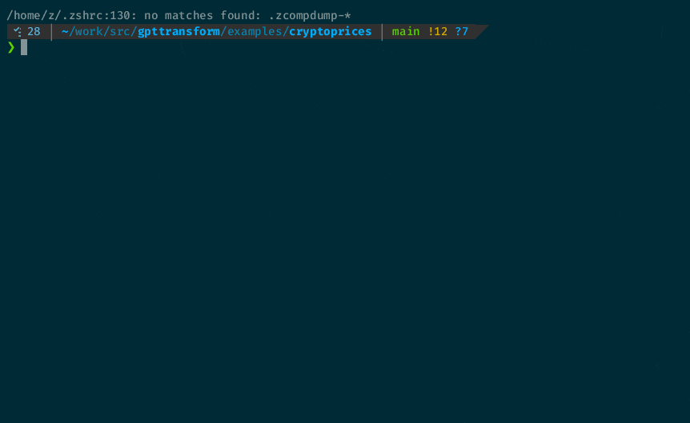

# Crypto Price Analysis with ThoughtLoom

This example demonstrates how to use ThoughtLoom to transform a few cryptocurrency prices into a buy or sell rationale.



## Directory Structure

```
./
├── buyorsell.toml              # Config for generating a buy or sell rationale.
├── example.sh                  # Main script to run the example.
├── README.md                   # This README file.
├── system.tmpl                 # System template for buy or sell rationale generation.
├── user.tmpl                   # User template for buy or sell rationale generation.
└── _work
    └── result.json             # The resulting buy or sell rationale in JSON format.
```

## How to Run the Example

1. Execute the `example.sh` script:

```bash
./example.sh
```

This script will perform the following steps:

- Fetch the last 10 hours of Bitcoin price history.
- Use ThoughtLoom with the `buyorsell.toml` configuration to generate a buy or sell rationale based on the price history.
- Print the result.

The output will be a rationale for buying or selling Bitcoin based on the recent price data.

## Example Files

- `buyorsell.toml`: The ThoughtLoom configuration file that defines how to process the input data.
- `system.tmpl`: The system template used by ThoughtLoom.
- `user.tmpl`: The user-defined template that will be used alongside the system template.
- `example.sh`: The script that fetches the data, runs ThoughtLoom, and prints the result.
- `_work/result.json`: The resulting buy or sell rationale in JSON format.

## Note

Please ensure that you have ThoughtLoom and the required dependencies installed before running this example.
