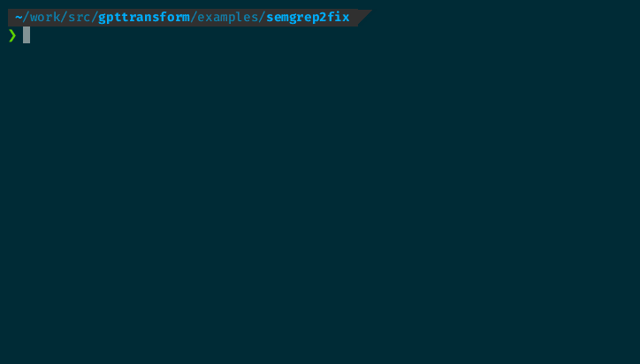

# Transform Semgrep Scan Results and Apply Fixes with ThoughtLoom

In this example, we will demonstrate how to use ThoughtLoom to transform Semgrep scan results into generated fixes, and apply them to the source code.

This example can exceed $1 USD in credits.



## Example Directory Structure

The example directory contains the following files:

```
.
├── 1shotassistant.tmpl (Assistant-prompt template for generating fixes)
├── 1shotuser.tmpl (User-prompt template for generating fixes)
├── example.sh (Bash script to run the ThoughtLoom example)
├── policies.txt (Code fix policies list)
├── README.md (This file)
├── sample-scripts (Directory containing sample scripts to be analyzed)
├── semgrep2fix.toml (Configuration file for generating fixes from Semgrep issues)
├── semgrep-sample (Directory containing Semgrep rules)
├── system.tmpl (System-prompt template for generating fixes)
├── user.tmpl (User-prompt template for generating fixes)
├── vuln2context.sh (Bash script to convert Semgrep issues to ThoughtLoom input format)
└── _work (Directory for storing intermediate and output files)
```

## How to Run the Example

1. Ensure that ThoughtLoom, Semgrep, and jq are installed and the API keys for OpenAI or Azure are properly set up as environment variables.

2. Navigate to the example directory:

```bash
cd examples/semgrep2fix
```

3. Run the example.sh script:

```bash
./example.sh
```

This script will execute the following steps:

- **Step 1:** Run Semgrep scan on `sample-scripts` directory using the rules in `semgrep-sample`. The output will be stored as `_work/issues.json`.

- **Step 2:** Generate fixes using the `semgrep2fix.toml` template with the input from `_work/issues.json`. The output will be stored as `_work/fixes.json`.

- **Step 3:** Iterate through the fixes in `_work/fixes.json` and create patch files in the `_work/patches` directory.

- **Step 4:** Apply the patches to the source code with a specified fuzz factor and report the success or failure of each patch application.

After the script finishes running, you can view the transformed issues, generated fixes, and patch files in the `_work` directory.

## Sample Fixes

Run for run around half of the patch files apply without modification.

Here's a sampling of final outputs;

```diff
--- sample-scripts/example.sh
+++ sample-scripts/example.sh
@@ -14,7 +14,7 @@
 echo "Step 2/2: Generating output with thoughtloom"
- cat '_work/input.json' | thoughtloom -c './buyorsell.toml' > '_work/result.json'
+ thoughtloom -c './buyorsell.toml' < '_work/input.json' > '_work/result.json'

 # Step 4: Print the result
 echo "Printing the result:"
```

```diff
--- sample-scripts/sections2paper.sh
+++ sample-scripts/sections2paper.sh
@@ -14,7 +14,7 @@
 total_responses=$(jq -sr 'length' "$json_file")

-echo $total_responses
+echo "$total_responses"

 for ((i = 0; i < total_responses; i++)); do
   first_line=$(jq -sr --argjson index "$i" '.[$index].response | split("\n") | .[0]' "$json_file")
```

```diff
--- sample-scripts/example.sh.orig
+++ sample-scripts/example.sh.orig
@@ -14,7 +14,7 @@
 echo "Step 2/2: Generating output with thoughtloom"
- cat '_work/input.json' | thoughtloom -c './buyorsell.toml' > '_work/result.json'
+ thoughtloom -c './buyorsell.toml' < '_work/input.json' > '_work/result.json'

 # Step 4: Print the result
 echo "Printing the result:"
```

```diff
--- sample-scripts/example.sh.orig
+++ sample-scripts/example.sh
@@ -15,7 +15,7 @@
 echo "Step 2/2: Generating output with thoughtloom"
-cat '_work/input.json' | thoughtloom -c './buyorsell.toml' > '_work/result.json'
+thoughtloom -c './buyorsell.toml' < '_work/input.json' > '_work/result.json'

 # Step 4: Print the result
 echo "Printing the result:"
@@ -23,4 +23,4 @@
-cat '_work/result.json' | jq -r .response
+jq -r .response < '_work/result.json'
```

```diff
--- sample-scripts/example.sh
+++ sample-scripts/example.sh
@@ -15,7 +15,7 @@
 echo "Step 2/2: Generating output with thoughtloom"
-cat '_work/input.json' | thoughtloom -c './buyorsell.toml' > '_work/result.json'
+thoughtloom -c './buyorsell.toml' < '_work/input.json' > '_work/result.json'

 # Step 4: Print the result
 echo "Printing the result:"
-cat '_work/result.json' | jq -r .response
+jq -r .response < '_work/result.json'
```

```diff
--- sample-scripts/sections2paper.sh
+++ sample-scripts/sections2paper.sh
@@ -32,7 +32,7 @@
     if [ -n "$response" ]; then
-      echo AddingSection: [$response]
+      echo "AddingSection: [$response]"
       combined_responses+="${response}\n\n"
     fi
   fi
```

```diff
--- sample-scripts/sections2paper.sh
+++ sample-scripts/sections2paper.sh
@@ -28,7 +28,7 @@
 while read -r line; do
-  echo Considering: [$line]
+  echo "Considering: [$line]"
     if [ -n "$line" ]; then
     response="${responses["$line"]}"
     if [ -n "$response" ]; then
       echo AddingSection: [$response]
```

```diff
--- sample-scripts/sections2paper.sh
+++ sample-scripts/sections2paper.sh
@@ -19,7 +19,7 @@
   response=$(jq -sr --argjson index "$i" '.[$index].response' "$json_file")
-  echo Line: [$first_line]
+  echo "Line: [$first_line]"
   if [ -n "$response" ]; then
     responses["$first_line"]="$response"
   fi
```

```diff
--- sample-scripts/vuln2context.sh
+++ sample-scripts/vuln2context.sh
@@ -35,7 +35,7 @@
   # Get the contents of the file including FIX START and FIX END comments
-  contents=$(awk -v start_line=$start_line -v first_line=$first_line -v end_line=$end_line -v last_line=$last_line -v check_id=$check_id '
+  contents=$(awk -v start_line="$start_line" -v first_line="$first_line" -v end_line="$end_line" -v last_line="$last_line" -v check_id="$check_id" '
     NR>=first_line && NR<start_line { print }
     NR==start_line { printf "# FIX START [%s]\n", check_id; print }
     NR>start_line && NR<=end_line { print }
@@ -43,7 +43,7 @@
     NR>end_line+1 && NR<=last_line { print }
   ' "$file_path")

-  policy=$(awk -v check_id=$check_id '/^# rule:\s*/ { in_block = match($0, check_id) } in_block { print }' "$script_dir/policies.txt")
+  policy=$(awk -v check_id="$check_id" '/^# rule:\s*/ { in_block = match($0, check_id) } in_block { print }' "$script_dir/policies.txt")

   # Create JSON object
   jq -n \
```

```diff
--- sample-scripts/vuln2context.sh
+++ sample-scripts/vuln2context.sh
@@ -40,7 +40,7 @@
   contents=$(awk -v start_line=$start_line -v first_line=$first_line -v end_line=$end_line -v last_line=$last_line -v check_id=$check_id '
     NR>=first_line && NR<start_line { print }
     NR==start_line { printf "# FIX START [%s]\n", check_id; print }
     NR>start_line && NR<=end_line { print }
     NR==end_line+1 { printf "# FIX END [%s]\n", check_id; print }
     NR>end_line+1 && NR<=last_line { print }
   ' "$file_path")

-  policy=$(awk -v check_id=$check_id '/^# rule:\s*/ { in_block = match($0, check_id) } in_block { print }' "$script_dir/policies.txt")
+  policy=$(awk -v check_id="$check_id" '/^# rule:\s*/ { in_block = match($0, check_id) } in_block { print }' "$script_dir/policies.txt")

   # Create JSON object
   jq -n \
     --arg xcheck "$check_id" \
     --arg xfile "$file_path" \
     --argjson xstart "$first_line" \
     --argjson xend "$last_line" \
     --arg xcontents "$contents" \
     --arg xpolicy "$policy" \
     '{check: $xcheck, file: $xfile, start: $xstart, end: $xend, contents: $xcontents, policy: $xpolicy}'
```

## License Note

This example includes files from the '[semgrep-rules](https://github.com/returntocorp/semgrep-rules)' repository, they are limited to the `./semgrep-sample` directory, there are licensed differently from this project.