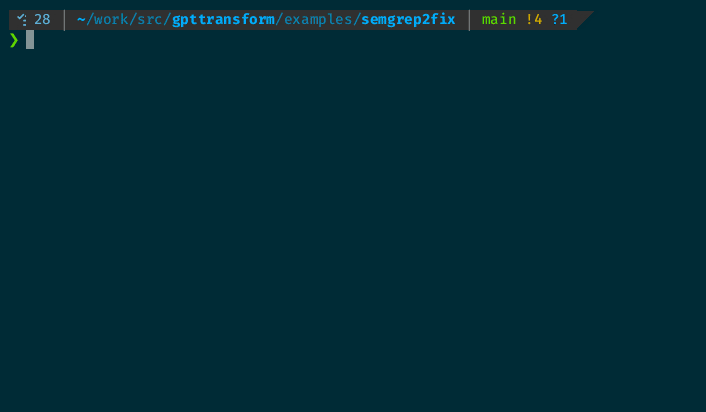

# Semgrep Rule to Fix Policy Generation with ThoughtLoom

This example demonstrates how to use ThoughtLoom to generate concise code fix policies from Semgrep rules and their corresponding positive and negative test files.



## Directory Structure

```
./
├── 1shotassistant.tmpl          # 1 shot example response assistant template for ThoughtLoom.
├── 1shotuser.tmpl               # 1 shot example user template for ThoughtLoom.
├── example.sh                   # Main script to run the example.
├── README.md                    # This README file.
├── semgrep2fix.toml             # Config for generating fix policies.
├── semgrep-sample/              # Sample directory containing Semgrep rules and test files.
├── system.tmpl                  # Instructive system template for OpenAI LLMs.
├── user.tmpl                    # The User prompt template.
└── _work
    └── results.json             # Final JSON results.
```

## How to Run the Example

1. Execute the `example.sh` script:

```bash
./example.sh
```

This script will perform the following steps:

- Loop through the Semgrep rules and test files in the `semgrep-sample` directory.
- Process each rule and its corresponding test files using the `process_file_pair` function.
- Use ThoughtLoom with the `semgrep2fix.toml` configuration to generate a fix policy based on the input data.
- Print out those policies.

The output will be a concise fix policy for each Semgrep rule.


## Template Files

- `system.tmpl`: The system chat LLM prompt. It explains the task of generating concise fix policies from Semgrep rules and their corresponding positive and negative test files.
- `1shotuser.tmpl`: An example of a user query provided to the LLM.
- `1shotassistant.tmpl`: An example of correct output provided to the LLM.
- `user.tmpl`: The template that forms the user-query for generating a fix policy.

## Note

Please ensure that you have ThoughtLoom and the required dependencies installed before running this example.

## License Note

This example includes files from the '[semgrep-rules](https://github.com/returntocorp/semgrep-rules)' repository, they are limited to the `./semgrep-sample` directory, there are licensed differently from this project.